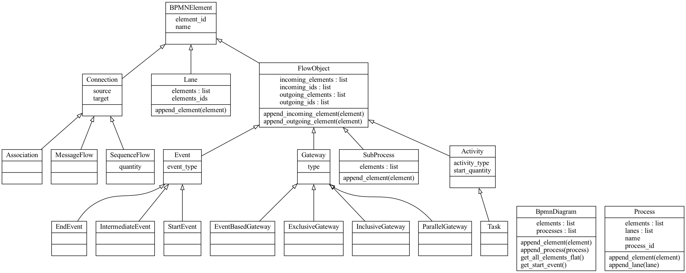
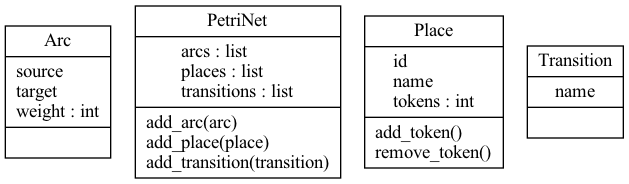

## Engineering Project

## Examples
<div style="background: white">

|                                              bpmn                                              |                                              petri                                              |
|:----------------------------------------------------------------------------------------------:|:-----------------------------------------------------------------------------------------------:|
|  |  |
|          |          |
|                        |                        |
|            |            |
|          |          |
|          |          |

</div>
### BPMN Diagram

#### Files Architecture:

##### Classes:



### Petri Network



## Tests

``` shell
make test
```

or if you want the code coverage 

``` shell
make test-coverage
```

## Ressources

- https://scholar.cu.edu.eg/?q=imanhelal/files/is333_mis_lab8_2013.pdf
